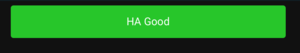
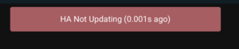

# Overview

This is a lovelace plugin for home assistant that allows you to monitor for hass updates.  

Normally when you set up a dashboard you will see a subtle warning if the connection to HA is lost.  This warning is too subtle for me.  Hence the need for a larger, customizable alert.  Empircally we find hass updates all custom cards with new states several times a minute.  Thus we warn, by default, if no update is received within a minute.

Note that the watchdog function is purposefully done on the frontend, not on the backend, as this is intended to warn the user - not backend services - of loss of HA monitoring.

# Installation
In order to use this plugin put lovelace-watchdog.js into your HA wwww directory, then go to your HA lovelace settings and add it as a lovelace resource.

# Card Creation
The card can be used as follows - all settings are optional:

```yaml
type: custom:lovelace-watchdog
good_text: Connected
bad_text: Loss of HA connection
good_background_color: green
good_text_color: white
bad_background_color: green
bad_text_color: white
error_if_no_update_seconds: 12
alarm_flash_period: 2
blink_color: rgba(255,0,0,.5)
```

This produces something like the following if eveything is updating: 

If more than the threshold has elapsed, the colors change and the card blinks: 


